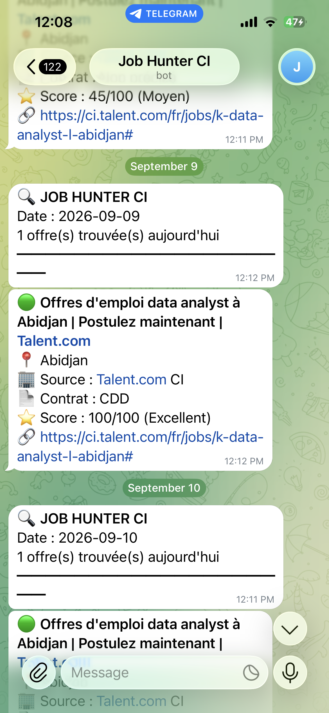

# 🔍 JOB HUNTER CI — Moteur automatisé de veille emploi

[](https://emmanueldigbeu.shinyapps.io/JOB_HUNTER_CI/)
[](https://www.r-project.org/)
[](https://t.me/job_hunter_ci_ange_bot)

## 🎯 Le problème

Chercher un emploi en Côte d'Ivoire signifie consulter manuellement une vingtaine de sites chaque jour, trier des centaines d'annonces dont la majorité ne correspond ni au profil ni à la zone géographique visée. Un travail répétitif, chronophage, et dans lequel les bonnes offres passent facilement inaperçues.

## 💡 La solution

Un pipeline R entièrement automatisé qui collecte, nettoie, score et livre chaque matin les offres pertinentes directement sur Telegram — sans intervention humaine.

```
Collecte multi-sources → Nettoyage → Scoring → Livraison Telegram
      (~23 sites)         (dédup.)   (0-100)     (9h00, auto)
```

## ⚙️ Architecture

Le pipeline est organisé en scripts modulaires orchestrés par un lanceur principal :

| Script | Rôle |
|---|---|
| `00_run_JOB_HUNTER_CI.R` | Orchestration de l'ensemble du pipeline |
| `01_initialisation_agent.R` | Chargement du profil candidat et des paramètres |
| `02_moteur_recherche_candidat.R` | Construction des requêtes de recherche |
| `03_configuration_sources_offres.R` | Configuration des ~23 sources à scraper |
| `03_2_collecte_offres_reelles.R` | Collecte effective des offres |
| `03_2_2_nettoyage_offres.R` | Nettoyage, déduplication, normalisation |
| `04_*` | Modules de collecte spécifiques par source |

## 🎯 Le moteur de scoring

Chaque offre reçoit une note sur 100 selon une logique à plusieurs niveaux :

- **Mots-clés distinctifs vs génériques** — une offre sans mot-clé distinctif est plafonnée à 35 points, ce qui écarte automatiquement les annonces vaguement liées au domaine
- **Bonus titre** — +15 points lorsque l'intitulé correspond directement au poste recherché
- **Pénalité géographique** — −60 points pour toute offre confirmée hors zone cible, ce qui fait redescendre les annonces internationales sous le seuil de pertinence
- **Classement final** — 🟢 Excellent (>70) · 🟡 Moyen (50-70) · 🔴 Faible (<50)

## 🚧 Problèmes techniques résolus

Le projet a nécessité plusieurs résolutions concrètes :

- **Interception SSL / Cloudflare** empêchant les requêtes sortantes → contournement au niveau de la configuration de libcurl
- **Blocage réseau par le pare-feu Windows** stoppant l'accès internet de R → diagnostic et correction
- **Filtrage géographique LinkedIn** → utilisation du paramètre `geoId` spécifique à la Côte d'Ivoire
- **Doublons et faux positifs récurrents** → déduplication sur URL et renforcement des règles de scoring
- **Perte de variables globales entre scripts** → nettoyage sélectif de l'environnement au lieu d'un `rm(list = ls())` brut

## ⏰ Automatisation

Le pipeline s'exécute automatiquement chaque matin à 9h00 via le Planificateur de tâches Windows, déclenché par un fichier `.bat`, et configuré pour fonctionner même sans session utilisateur active.

## 📱 Livraison Telegram

Les offres retenues sont envoyées sous forme de message structuré via un bot Telegram : titre, localisation, source, type de contrat, score, et lien direct vers l'annonce.



## 🖥️ Démo interactive

Une application Shiny présente un échantillon de résultats réellement produits par le pipeline, avec filtres par score, par source et par niveau de pertinence.

👉 **[Ouvrir la démo](https://emmanueldigbeu.shinyapps.io/JOB_HUNTER_CI/)**

> La démo affiche un échantillon figé de résultats. Le pipeline complet (collecte, scoring, livraison Telegram) s'exécute en local de façon planifiée.


## 🛠️ Stack technique

**R** · `httr` · `rvest` · `dplyr` · `stringr` · `shiny` · `DT` · `ggplot2` · Windows Task Scheduler · API Telegram Bot

## ✅ Résultat

- Veille emploi quotidienne entièrement automatisée, sans action manuelle
- ~23 sources consultées en une exécution
- Tri automatique des offres non pertinentes avant même la lecture
- Livraison directe sur mobile, chaque matin

---

*Projet personnel développé de bout en bout : conception, développement, débogage et mise en production.*
